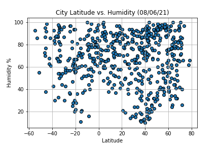

# Python API Challenge

In this challenge APIs will be explored using Open Weather and Google Maps.

## Using Scatter Plots and Google Heat Layer
The following scatter plots analyzes the data of about 500 random cities collected from Open Weather. From those 500 cities it is then narrowed down to 7 cities to then pin them using google maps and its different layering methods. 

### Plotting the Cities data to Analyze Temperature, Humidity, Cloudiness, and Wind Speed
This scatterplot is presenting the pattern of latitude versus the max temperature. This appears to be a strong, non-linear plot where the latitude numbers close to the equator tend to rise in temperature and as the latitude gets closer to the southern or northern hemisphere the temperature begins to drop.

This scatter plot is comparing the latitude versus the humidity from a given city and it appears that there is no correlation between the two.

In the latitude versus cloudiness scatter plot, there appears to be a lot of accumulated points at the very top and bottom of the chart where both the southern and northern latitudes have points for cloudiness in the 0s and 100s. There are also many points plotted throughout the chart. Based on this observation there appears to be no relationship between the two. 

For the latitude versus wind speed scatter plot, it appears that there is no relationship. Although there is no trend, it can be observed that based that the wind speeds below 15mph seemed to have been more common among the cities than speeds above 15mph.

 

### Analyzing the Northern and Southern Hemispheres

#### Northern Hemisphere Temp vs Lat
When observing the plot for the Northern Hemisphere we can see that there is a downward trend with an estimated r-value of about 38%. We can also see that the relationship is not as strong based on how the other points don’t seem to be following the fitted line. Based on the plot we would see that as the latitude moves higher, the max temperature would drop but this isn’t always the case on a handful of these points. 

#### Southern Hemisphere Temp vs Lat
For the Southern Hemisphere plot with the max temperature versus the latitude, it appears to have a positive trend with a stronger relationship when compared to the Northern Hemisphere plot. The stronger relationship can be seen from the r-value which is about 65% and from the plot points that follow the fitted line more closely.  

#### Northern Hemisphere Humidity vs Latitude
On the humidity versus latitude plot for the Northern Hemisphere we see that there are many plot points with no trend or correlation. Visually it can be seen that the plot points are not following the fitted line and we can see the weak relationship from the r-value of 0.038%.

#### Southern Hemisphere Humidity vs Latitude
For the Southern Hemisphere we observe the humidity versus latitude plot ndoes not contain a trend or correlation. The plot points do not follow the fitted line well and the r-value is about 0.11%. 

#### Northern Hemisphere Cloudiness vs Latitude
When comparing the relationship between the cloudiness and latitude for the Northern Hemisphere we see that there is no correlation or trend. Many of the plot points are not following the fitted line closely and the relationship between the two also appears to be weak based from fom the r-value which is about 0.12%.

#### Southern Hemisphere Cloudiness vs Latitude
Like the Nothern Hemisphere, we can see that there is no trend or relationship between the cloudiness and latitude. Although the fitted line seems to be moving on a negative trend, the plot points are not following the fitted line closely. The weakness in the relationship can also be seen from the r-value that is about 1.2%.  

#### Northern Hemisphere Wind Speed
Similar to the first wind speed comparison we can see that for the Northern Hemisphere the wind speed seems to be more common below 15mph and less common above the 15mph. By the way the points are plotted and the r-value of about 1.6% there appears to be no relationship between the two. 

#### Southern Hemisphere Wind Speed
For the Southern Hemisphere plot that compares the wind speed and latitude, we can also see that there is no relationship. This can be seen by observing how the plot points are not following the fitted line and by the r-value of about 0.7%. 

